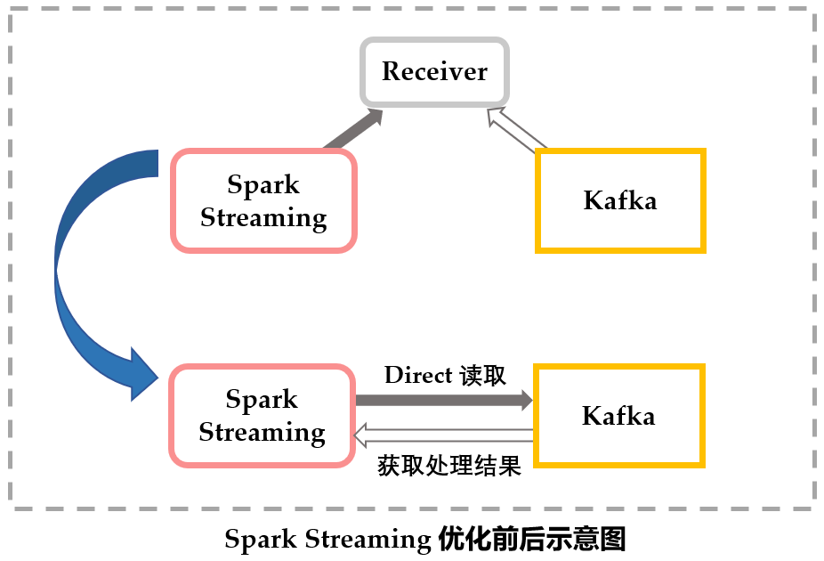
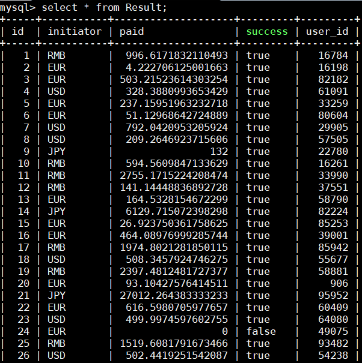

## Lab5: 分布式事务管理系统	-group7

### 实验背景  
假设有一个热门的国际购物平台，它需要处理高并发的购物订单。因为它是为世界各地的用户设计，它应该能够支持不同的货币结算。当用户购买商品时，系统会根据当前汇率将原价格兑换成目标货币的价格。

### 实验目的

基于4台云服务器，使用Zookeeper, Kafka, Spark服务框架和MySQL，设计并实现一个分布式交易结算系统，功能包括接收和处理贸易订单、记录所有交易结果和总交易金额、定时更新汇率，在实现基本功能的基础上尽可能地优化throughput和latency、支持高并发。


## TODO

-  ~~配置完成zookeeper + kafka + spark streaming~~
-  ~~用spark streaming消费kafka的topic数据~~
-  ~~使用zookeeper存储并写入汇率数据~~
-  ~~使用mysql存储持久化数据~~
-  ~~通过zookeeper实现访问商品信息前加锁~~
-  ~~生成随机订单数据文件~~
-  ~~在应用开始时重置数据库~~
-  ~~通过http sender发送订单数据~~
-  ~~通过http receiver接受数据并发送给kafka~~
-  ~~通过zookeeper实现total transaction num的查询~~
-  ~~启动并行单元实时更改汇率数据~~
-  ~~在单机系统下完成订单处理~~
-  **~~在分布式系统下完成订单处理 (完成基本任务)~~**
-  使用spark streaming的Direct API方式与kafka连接
-  采用分布式的文件系统(eg. hdfs)
-  采用分布式的Mysql(通过zookeeper管理)
-  使用不同的spark集群配置(eg. yarn mesos k8s)


## 1 System Environment
### 1.1 云服务器配置

- centos
- 8GB DRAM * 4
- 4-core CPU * 4

### 1.2 集群概览

- **各服务器的职能**

| 虚拟机         | zookeeper   | kafka |spark|
| ------------- | ----------- | ----- |-----|
| dist-1 		|  	✔		  |  ✔   |master|
| dist-2 		| ✔ 		  | ✔    |slave|
| dist-3 		| ✔   		  | ✔    |slave|
| dist-4 		|  			  |  	  |	    |


## 2 Install and Configuration
首先需要下载Zookeeper, Kafka, Spark等各种包，因此需要先安装wget指令

``` shell
yum -y install wget
```

配置四台虚拟机之间的域名映射

``` shell
# /etc/hosts
10.0.0.43   dist-1
10.0.0.18   dist-2
10.0.0.86   dist-3
10.0.0.47   dist-4
```

### 2.1 安装Zookeeper

首先下载合适版本的包，这里选择了zookeeper-3.4.14.tar.gz

``` shell
wget https://mirrors.tuna.tsinghua.edu.cnlog4j/apache/zookeeper/zookeeper-3.4.14/zookeeper-3.4.14.tar.gz
```
解压至指定文件夹

``` shell
tar zxvf zookeeper-3.4.14.tar.gz -C ~/soft
```
创建软链接方便使用

``` shell
cd ~/soft
ln -s zookeeper-3.4.14 zk
```
随后修改默认的配置文件
``` shell
cd conf
cp zoo_sample.cfg zoo.cfg
```
zoo_sample.cfg为里面自带的样例配置文件，这里直接采用它，需要修改一下：
``` shell
# ~/soft/zk/conf/zoo.cfg
dataDir=/home/centos/zookeeper/data
server.1=dist-1:2888:3888
server.2=dist-2:2888:3888
server.3=dist-3:2888:3888
```


### 2.2 安装Kafka

``` shell
wget http://mirrors.tuna.tsinghua.edu.cn/apache/kafka/2.2.1/kafka_2.11-2.2.1.tgz
tar zxvf kafka_2.11-2.2.1.tgz -C ~/soft
cd ~/soft
ln -s kafka_2.11-2.2.1.tgz kafka
```
修改配置文件

``` shell
# ~/soft/kafka/config/server.properties
broker.id=0 # different in each node

zookeeper.connect=dist-1:2181,dist-2:2181,dist-3:2181  #zookeeper config

```

### 2.3 安装spark
spark与hadoop的关系

- spark使用hdfs作为分布式的文件系统，而在local或者standalone模式下不需要hdfs，因此不需要先安装hadoop


``` shell
wget http://mirrors.tuna.tsinghua.edu.cn/apache/spark/spark-2.4.3/spark-2.4.3-bin-hadoop2.7.tgz
tar zxvf spark-2.4.3-bin-hadoop2.7.tgz -C ~/soft
cd ~/soft
ln -s spark-2.4.3-bin-hadoop2.7.tgz spark
```

修改配置文件
``` shell
# ~/soft/spark/conf/slaves
dist-1
dist-2
dist-3
```
在三台机器上都配置slaves文件

### 2.4 安装Hadoop(optional)

### 2.5 配置Mysql

选择使用dist-1作为数据库服务器，本地配置mysql。

``` shell
# 下载mysql的repo源
> wget http://repo.mysql.com/mysql-community-release-el7-5.noarch.rpm

# 安装mysql-community-release-el7-5.noarch.rpm包
> sudo rpm -ivh mysql-community-release-el7-5.noarch.rpm

# 安装mysql，并按照命令行提示设置密码
> sudo yum install mysql-server -y

# 登录mysql
> mysql -u root -p

# 创建数据库lab5和表格commodity, result
create database lab5;
create table commodity(
  id        INT         NOT NULL PRIMARY KEY,
  name      VARCHAR(11) NULL,
  price     DOUBLE      NULL,
  currency  VARCHAR(5)  NULL,
  inventory INT         NULL) ENGINE = InnoDB;

create table result(
  id        INT AUTO_INCREMENT PRIMARY KEY,
  user_id   INT        NULL,
  initiator VARCHAR(5) NULL,
  success   VARCHAR(5) NULL,
  paid      DOUBLE     NULL) ENGINE = InnoDB;

```

### 2.6 启动zookeeper,kafka,spark服务
```shell
# your/path/to/zookeeper/bin
./zkServer.sh start
```
```shell
# your/path/to/kafka/bin
./kafka-server-start.sh ../config/server.properties
```
spark启动前需要在master节点上配置slaves文件
```shell
# your/path/to/spark/conf/slaves
[worker1-hostname]
[worker2-hostname]
[worker3-hostname]
...
```
启动服务
```shell
# your/path/to/spark/sbin
./start-all.sh
```
这个脚本会自动启动各个slave上的worker,不然需要在各个slaves上各自启动worker

提交Spark应用
```
spark-submit --master spark://[master-node]:7077 [yourapp].jar
```


## 3. Program Design


### 3.1 用Kafka接收order flow

kafka提供了许多简易的API可以直接调用，使用kafka.producer API实例化生产者。

**OrderProducer.java：** 向kafka集群发送订单数据的producer。

- 使用`java.util.Properties`配置并初始化kafka producer实例。
    - 加入集群节点到broker-list
    - 发送的message类型为String，所以设置序列化参数为StringEncoder

- 调用`producer.send()`接口，将缓冲池中的消息异步地发送到broker的指定topic中。

  异步发送是指，`send()`将消息存储到底层待发送的I/O buffer后，将立即返回，从而并行无阻塞地发送更多消息，因此kafka能批量处理消息(batch)以提高效率。

```java
import kafka.javaapi.producer.Producer;
import kafka.producer.KeyedMessage;
import kafka.producer.ProducerConfig;

public static void main(String args[]) {
     Properties properties = new Properties(); //--2
     properties.put("metadata.broker.list","dist-1:9092,dist-2:9092,dist-3:9092");
     properties.put("serializer.class","kafka.serializer.StringEncoder");
     properties.put("request.require.acks","1");
     ProducerConfig config=new ProducerConfig(properties);
     producer=new Producer<>(config);
     while (true) {
     	String message = order();
        producer.send(new KeyedMessage<>("kafka_spark",message));
        System.out.println("sent " + message);
        try {
            Thread.sleep(1000);
        }catch (InterruptedException e){
            e.printStackTrace();
        }
     }
}
```


### 3.2 Spark Streaming进行计算和处理
该系统通过Spark Streaming读取Kafka Producer的消息，转换成可操作的、按照时间段分割的数据流，用批处理的方式处理订单。

**App.java：**

- 通过 JavaStreamingContextFactory构建Streaming context对象，指明应用名称"Order Processing"、时间窗口大小(即批处理时间间隔)为**3s** 。

  ```java
  SparkConf conf = new SparkConf().setAppName("Order Processing");
  JavaSparkContext sc = new JavaSparkContext(conf);
  sc.setLogLevel("WARN");
  JavaStreamingContext jssc = new JavaStreamingContext(sc, Durations.seconds(2));
  ```

- 创建inputDstream，定义数据源。本项目利用KafkaStream的API，创建Kafka topic后，直接读取kafka。

  **TODO: offset的保存，提及优化**

  ```java
  Map<String, Integer> topicMap = new HashMap<String, Integer>();
  topicMap.put("kafka_spark", 1);
  JavaPairReceiverInputDStream<String, String> messages =
         			KafkaUtils.createDirectStream(jssc,
     				"dist-1:2181,dist-2:2181,dist-3:2181", "spark_receiver", topicMap);
  ```



- 对messages进行map操作按时间切分、转换成DStream，再进行map操作传入订单处理模块，进行处理返回结果的DStream。

    ```java
    JavaDStream<String> results = lines.map(OrderProcessor::process);
    ```

- **DStream：** 是Spark Streaming中的一个基本抽象，代表数据流，隐藏了实现细节。DStream可以从kafka等输入源获得，也可以转换得到。在 DStream 内部维护了一组离散的以时间轴为键的 RDD 序列，每个RDD 包含了指定时间段内的数据流，我们对于 DStream 的各种操作最终都会映射到内部的 RDD 上，最终提交给Spark处理。


- 配置后调用start()正式启动Spark Streaming。

  ```java
  jssc.start();
  jssc.awaitTermination();
  ```


### 3.3 Zookeeper的事务管理

#### 3.3.1 分布式锁的实现（LockService.java）

**init()**: 初始化Zookeeper服务器，若服务器上不存在 `/lock` 节点则创建，该节点是一个持久节点(PERSISTENT)

```java
Stat stat = zookeeper.exists(parentPath, null);
if (stat == null) {
	zookeeper.create(parentPath, "for lock".getBytes(), ZooDefs.Ids.OPEN_ACL_UNSAFE, CreateMode.PERSISTENT);
}
```

**lock():**

- 在父节点 `/lock` 下创建一个临时顺序子节点(EPHEMERAL_SEQUENTIAL)，该节点会在客户端断开连接时删除，并且服务器会给该节点加上一个全局唯一的顺序后缀。指定子节点的前缀，最终创建的节点路径为`/lock/lock-0000000001`.  

```java
String lockPath = zookeeper.create(lockPrefix, "lock node".getBytes(),
                    ZooDefs.Ids.OPEN_ACL_UNSAFE, CreateMode.EPHEMERAL_SEQUENTIAL);
```

- 获取 `/lock` 节点的所有子节点，按后缀排序后判断第一步创建的节点是不是所有子节点中顺序最小的节点，如果是，则lock()函数返回，调用者获得锁

```java
List<String> children = zookeeper.getChildren("/lock", false);
Collections.sort(children, new Comparator<String>() {    
	public int compare(String left, String right) {        
		String leftId = left.substring(lockPrefix.length());        
		String rightId = right.substring(lockPrefix.length());
                return leftId.compareTo(rightId);
        }
});
if (nodePath.equals(children.get(0))) {    
	System.out.println(nodePath + " acquire the lock");
}
```

- 若当前节点不是最小的节点，则创建 `LockWatcher` 来监听前一个节点的删除事件，接着 `LockWatcher` 会调用 `latch.countDown()` 使得正在等待 `latch` 的 `lock()`函数能够继续执行下去获得锁

```java
CountDownLatch latch = new CountDownLatch(1);
LockWatcher lockWatcher = new LockWatcher(latch);
Stat stat = zookeeper.exists(prePath, lockWatcher);
if (stat != null) {    
    latch.await();
}
```

  **unlock():** 获取 `/lock` 父节点的所有子节点，删除其中顺序号最小的节点

------

**TODO 锁还在修改** ，结合3.2与3.3.1的部分，Spark集群接收到order processing任务后从master分发给slave，关系见如下示意图：


#### 3.3.2 用Zookeeper存储汇率表，并定时更新

**main()：** 定义4个并行的线程，分别对应4种货币，每分钟修改1次货币汇率。

```java
static public void main(String[] args) {
    String[] currencies = {"RMB","USD","JPY","EUR"};
    Double[] initValues = {2.0, 12.0, 0.15, 9.0};
    CurrentChange[] threads = new CurrentChange[currencies.length];
    for (int i = 0; i < threads.length; i++) {
        threads[i] = new CurrentChange(currencies[i],initValues[i]);
    }
    for (CurrentChange thread : threads) {
        thread.start();
    }
}
```

**CurrentChange类实现** ：继承Java.Thread类，@Override重写`Thread.run()`方法，使调用代码更简洁。

```java
public class CurrentChange extends Thread {
    @Override
    public void run(){
        //implementation of changing exchange rate every 60s
    }
}
```


### 3.4 MySQL存储数据与结果

- MySQL位于dist-1上，集群通过hibernate配置连接3306端口的数据库。
- Result的id设置为AUTO_INCREMENT自增。




此项目中使用zookeeper实现分布式锁作为应用层的锁，因此在数据库层面不需要增加隔离

### 3.5 测试数据与testfile

**order json：** input-0.json input-1.json input-2.json

**LockTest.java：** 用于测试zookeeper锁实现的正确性、可扩展性。


### 3.6 分析latency与throughput
**Latency:** 由于kafka的高性能，latency主要来自于Spark Streaming自身的流处理中，由于Spark Streaming采用batch的方式，并不是来一条处理一条的真实时处理(如Storm)，因此latency主要取决于process time以及batch interval，因此在这将latency视为单个Record处理的时间的平均值，可以通过Spark UI查看得到

**Throughtput:** 由于应用process time相对较长，因此单个Spark Receiver足以满足任务的吞吐量需求，因此主要瓶颈仍然在于process time

总结：优化重点在于减少**process time**

## 4. Problems

**Q1: kafka-console-consumer.sh --zookeeper xxx 报错**

A: 因为版本更新该参数改为--bootstrap-server，需要broker server而不是zookeeper server


**Q2: zkServer.sh start后status显示not running**

A: 可查看zookeeper.out文件
```shell
org.apache.zookeeper.server.quorum.QuorumPeerConfig$ConfigException: Error processing /home/centos/soft/zk/bin/../conf/zoo.cfg
        at org.apache.zookeeper.server.quorum.QuorumPeerConfig.parse(QuorumPeerConfig.java:156)
        at org.apache.zookeeper.server.quorum.QuorumPeerMain.initializeAndRun(QuorumPeerMain.java:104)
        at org.apache.zookeeper.server.quorum.QuorumPeerMain.main(QuorumPeerMain.java:81)
Caused by: java.lang.IllegalArgumentException: /home/centos/zookeeper/data/myid file is missing
        at org.apache.zookeeper.server.quorum.QuorumPeerConfig.parseProperties(QuorumPeerConfig.java:408)
        at org.apache.zookeeper.server.quorum.QuorumPeerConfig.parse(QuorumPeerConfig.java:152)
        ... 2 more

```
- 由于dataDir下的myid文件未创建
- 若日志显示正常status却未显示，可能由于集群模式还未完成选举，等所有机器都启动后再查看

**Q3: Field "id" doesn't have a default value**

A: 由于使用hibernete将Result表的id列设置为```@GeneratedValue(strategy = GenerationType.IDENTITY)```因此自增属性交由Mysql管理，而生产环境下的Mysql未配置id为AUTO INCREMENT，因此报错，通过```alter table Result modify id int AUTO INCREMENT;```修改完毕，需要保证连接数据库的进程关闭，否则会卡死。

**Q4: 发现spark应用消费速度过慢，只有个位数throughput**

A: 首先排查kafka本身吞吐量，通过kafka-producer-perf-test.sh测试发现kafka的吞吐量正常，其次怀疑任务本身过于耗时，通过不执行任务直接将input的数据print出来，问题没有得到解决，发现由于Dstream的print方法在数量大于10个时后续以省略号表示

**Q5: Web请求处理速度过慢，throughput仅有十几**

A: 由于之前在本机上发送订单请求，，怀疑由于Web Receiver瓶颈，因此将sender的python脚本进行打包，在集群上进行send，打算采用多个Receiver方式，然后发现服务器上send速度很快，因此问题为开发机至服务器间的网络

**Q6: Zookeeper产生死锁**

A：由于共享static变量， 多个worker/多线程拿锁产生问题，没有有效放锁。修改lockService类的实现，删去lockPath的static变量，并且每次zookeeper删除节点时都删除最小节点。


## 5. 性能分析（TODO）

由3.6分析可知，优化主要需要分析任务处理时间

2w条order
Read Uncommitted + no lock without        forceSync: 01:20
Read Repeatable  + no lock without        forceSync: 01:22
Read Uncommitted + no lock with           forceSync: 02:40
Read Repeatable  + no lock with           forceSync: 03:04
Read Uncommitted + commodity lock with    forceSync: 30~min
Read Uncommitted + commodity lock without forceSync: 02:28
Read Repeatable  + commodity lock without forceSync: 02:26
Read Uncommitted + single lock with       forceSync: 17:30
Read Uncommitted + single lock without    forceSync: 05:22
Read Repeatable  + single lock without    forceSync: 05:28

5.1 锁优化前：throughput约 17 order/sec


5.2 锁优化后：

## 6. Contribution

| 学号         | 姓名   | 分工 |
| ------------ | ------ | ---- |
| 516030910328 | 蔡忠玮 |      |
| 516030910219 | 徐家辉 |      |
| 516030910422 | 赵樱   | 水报告 |
| 516030910367 | 应邦豪 |划水   |


**项目Github**：https://github.com/sansazhao/Distributed-System-group7

**项目结构及说明：**

```
# 预期修改结果？
├─Service
│      CommodityService.java
│      ResultService.java
│      CurrentService.java		zookeeper管理汇率表
│      LockService.java			zookeeper分布式锁实现
│      Processor.java			订单处理
│      HibernateUtil.java		数据库连接
│      //ZooKeeperPool.java		never used
│      //TestApp.java
│
├─Current						
│      CurrentApp.java
│      CurrentChange.java		继承thread，修改汇率的实现
│  
├─Entity
│      Commodity.java
│      Result.java
│
├─Spark
│      SparkApp.java
│      OrderProcessor.java
│      OrderProducer.java
│      //SimpleLock.java
│      //SqlTest.java
│      //WriteLock.java
│      //Logger.java
│
└─Web
       WebApp.java				kafka producer(发送订单、添加商品)
```
